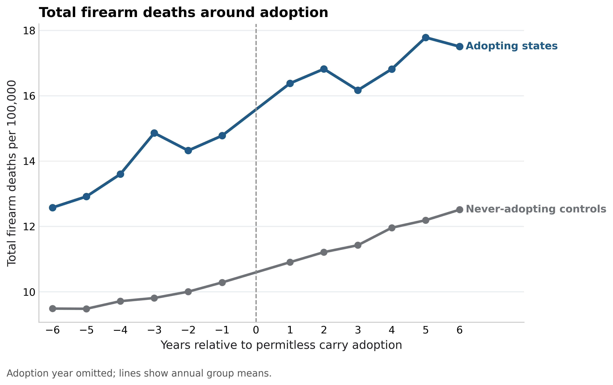

# Permitless Carry Policy Analysis (WRHC 2026)

This repository analyzes whether adoption of **permitless carry firearm laws** is associated with changes in firearm mortality rates across U.S. states.

The project constructs a **state–year panel dataset (1999–2024)** and evaluates post-adoption mortality patterns using multiple empirical strategies:

- change-score comparisons  
- two-way fixed effects difference-in-differences (DiD)  
- event-study analysis  
- heterogeneity analysis  
- political-selection analysis  

The goal is not to establish causal proof but to provide **transparent empirical comparisons** using publicly available data.

---

# Research Question

After a state adopts permitless carry laws, do firearm mortality rates change differently than in states that do not adopt the policy?

The analysis examines several outcomes:

- firearm suicide  
- firearm homicide  
- total firearm deaths  
- total suicide  
- non-firearm suicide  

---

# Data Sources

The project integrates multiple public datasets to build a unified state-year panel.

## Mortality Data
**CDC WONDER – Underlying Cause of Death**

Outcomes derived from ICD-10 mortality codes.

Key variables constructed:

- firearm suicide rate per 100,000
- firearm homicide rate per 100,000
- total firearm death rate per 100,000
- total suicide rate
- non-firearm suicide rate

Time coverage:

1999–2024

---

## Firearm Ownership

**RAND State-Level Household Firearm Ownership Database**

Variables used:

- estimated household firearm ownership share
- baseline firearm ownership by state

---

## Economic Controls

**Bureau of Labor Statistics (LAUS)**

- state unemployment rate

**Bureau of Economic Analysis**

- state per-capita personal income

---

## Geographic Structure

**USDA Economic Research Service**

Rural-Urban Continuum Codes (RUCC)

Derived measures:

- mean rurality index
- share of non-metro counties

---

## Political Variables

**MIT Election Lab – U.S. Presidential Elections**

Variables used:

- Republican two-party vote share
- baseline political environment by state

---

## Policy Data

Permitless carry adoption years were coded manually based on legislative enactment.

---

# Panel Dataset

Final dataset structure:

State × Year panel  
1999–2024  
50 U.S. states

Core variables include:

- firearm_suicide_rate_per_100k  
- firearm_homicide_rate_per_100k  
- total_firearm_rate_per_100k  
- total_suicide_rate_per_100k  
- nonfirearm_suicide_rate_per_100k  

Controls:

- unemployment_rate  
- income_pc  
- gun_ownership  
- rurality  

Policy variables:

- permitless_year  
- post_permitless  
- years_since_permitless  

---

# Empirical Methods

The project uses several complementary approaches.

---

# 1. Change-Score Design

For each state:

A = mean(post adoption rate) − mean(pre adoption rate)

Change scores are compared between:

- states adopting permitless carry  
- states that did not adopt  

Statistical test:

Welch two-sample t-test

Robustness windows:

- 2-year pre vs 2-year post  
- 3-year pre vs 3-year post  
- 5-year pre vs 5-year post  

---

# 2. Difference-in-Differences (TWFE)

Panel regressions estimate:

Outcome_st =  
β * PostPermitless_st  
+ State Fixed Effects  
+ Year Fixed Effects  
+ unemployment  
+ income  
+ error  

Standard errors are clustered at the state level.

---

# 3. Event Study

Event-time models estimate dynamic effects relative to the year of policy adoption.

This allows inspection of:

- pre-policy trends  
- post-policy evolution of mortality outcomes  

---

# 4. Heterogeneity Analysis

The analysis tests whether policy associations differ across state characteristics:

- baseline firearm ownership  
- rurality  
- baseline firearm suicide rates  

---

# 5. Political Selection

The project examines whether policy adoption is systematically associated with:

- political ideology  
- firearm prevalence  
- structural suicide risk  

This helps evaluate whether adoption occurs in states with distinct baseline risk profiles.

---

# Results

## Change-Score Results (Welch Tests)

| Outcome | Window | p-value |
|-------|------|------|
| Total firearm deaths | 2y | 0.019 |
| Total firearm deaths | 3y | 0.192 |
| Total firearm deaths | 5y | 0.201 |
| Firearm homicide | 2y | 0.800 |
| Firearm homicide | 3y | 0.598 |
| Firearm homicide | 5y | 0.634 |
| Firearm suicide | 2y | 0.000036 |
| Firearm suicide | 3y | 0.035 |
| Firearm suicide | 5y | 0.000697 |

### Key pattern

The strongest and most consistent statistical signal appears in **firearm suicide**.

Firearm homicide shows **no statistically significant change** across any robustness window.

---

# Event Study Plots

## Total Firearm Deaths



---

## Firearm Homicide


---

## Firearm Suicide


---

# Interpretation

Across multiple specifications:

- **Firearm suicide rates increase after permitless carry adoption relative to non-adopting states.**
- **Firearm homicide rates show no statistically significant change.**

The pattern suggests that observed increases in firearm mortality are primarily driven by **suicide rather than interpersonal violence**.

Panel regression results also indicate increases in **total suicide**, suggesting that the pattern may not be limited strictly to firearm-specific mechanisms.

---

# Limitations

Several limitations should be noted.

### Observational design
The study uses quasi-experimental comparisons and cannot establish causal effects.

### Policy adoption is not random
States adopting permitless carry differ structurally and politically from non-adopting states.

### Ecological data
State-level analysis cannot identify individual-level behavioral mechanisms.

### Staggered adoption complexity
Two-way fixed effects models may have limitations under staggered policy timing.

---

# Repository Structure

```
src/
    data/
        build_master_analysis_panel.py
        extend_master_outcomes.py
        process_unemployment.py
        process_income.py
        process_gun_ownership.py
        process_rurality.py
        process_politics.py

    analysis/
        run_all_analysis.py
        interpret_results.py

data/
    raw/
        mortality_data/
        economic_data/
        ownership_data/
        election_data/

    processed/
        analysis_panel_full_outcomes.csv
        state_year_income.csv
        state_year_unemployment.csv
        state_year_gun_ownership.csv

outputs/
    figures/
        event_study/
        heterogeneity/

    tables/
        did/
        heterogeneity/
        political_selection/
        main/
```

---

# Reproducing the Analysis

From the repository root:

### Build the panel dataset

```
python src/data/build_master_analysis_panel.py
python src/data/extend_master_outcomes.py
```

### Run the full empirical analysis

```
python src/analysis/run_all_analysis.py
```

### Generate the interpretation report

```
python src/analysis/interpret_results.py
```

Outputs will appear in:

```
outputs/tables
outputs/figures
```

---

# Authors

Yucheng (Richard) Wang  
WRHC 2026 Research Project

