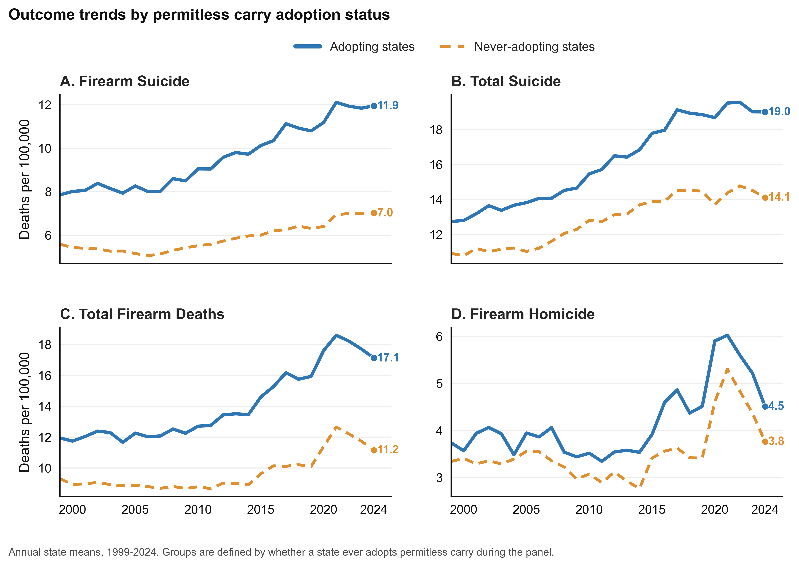
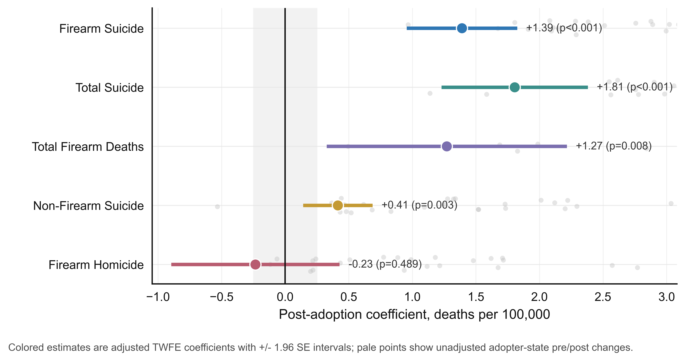
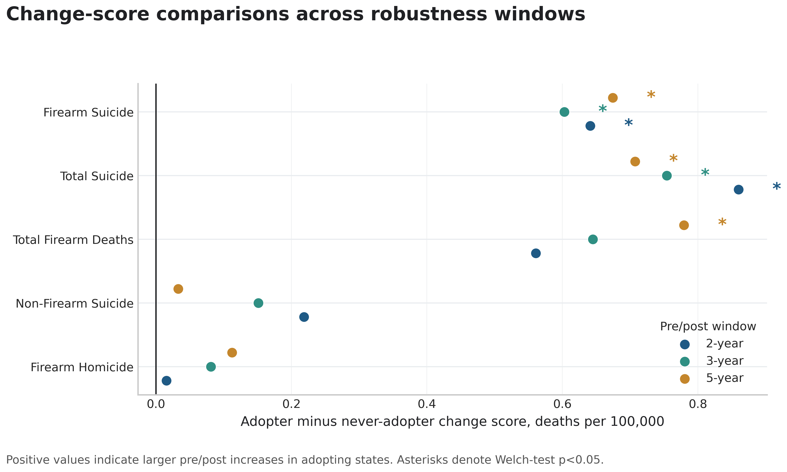
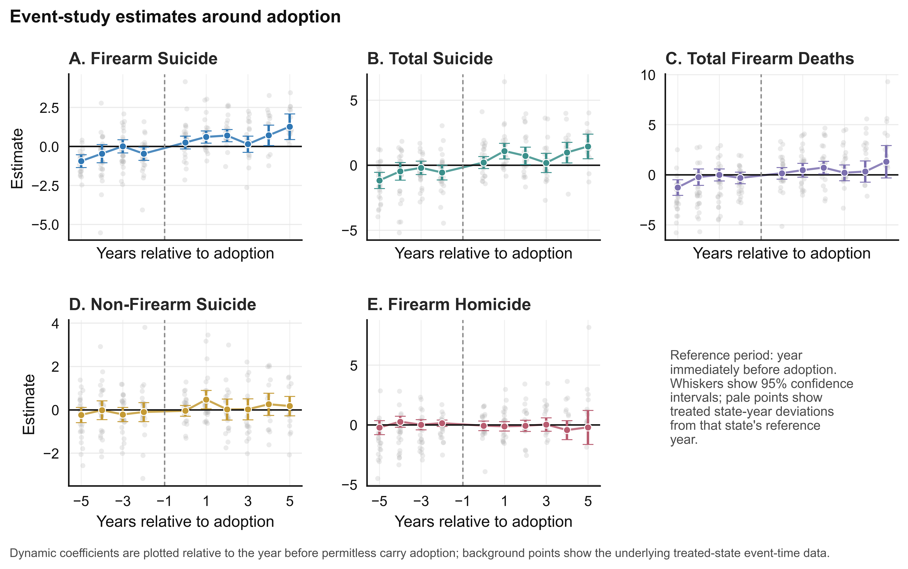
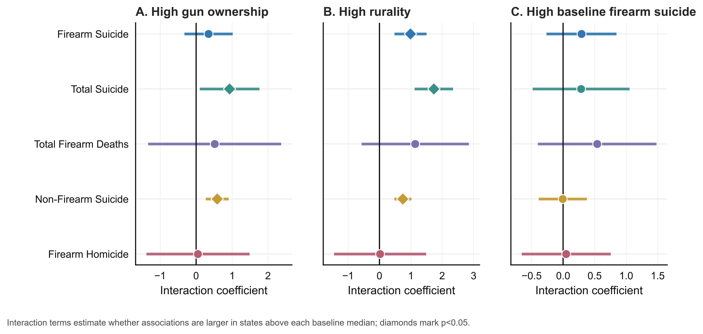
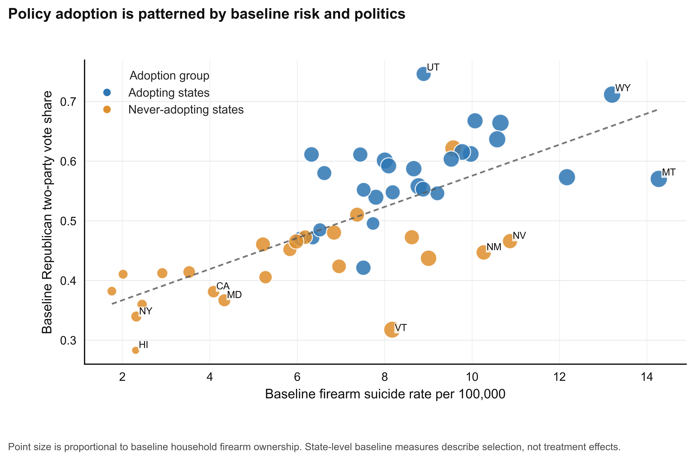

# Permitless Carry Laws and Firearm Mortality in the United States

This repository contains a state-year panel analysis of whether permitless carry law adoption is associated with changes in firearm mortality in the United States. The study links public mortality, economic, demographic, firearm ownership, rurality, and electoral data for the 50 states from 1999 through 2024, then evaluates post-adoption changes using complementary observational designs.

The analysis is designed as a transparent empirical research project rather than a causal claim. Permitless carry adoption is politically and structurally selected; the estimates should therefore be interpreted as adjusted associations conditional on the model and data, not as definitive evidence of individual-level mechanisms.

## Abstract

Permitless carry laws remove permit requirements for carrying concealed handguns. Their rapid diffusion across U.S. states raises a policy question: after adoption, do firearm mortality rates evolve differently in adopting states than in states that do not adopt? This project constructs a balanced state-year panel covering 1999-2024 and evaluates firearm suicide, firearm homicide, total firearm deaths, total suicide, and non-firearm suicide. The empirical strategy combines pre/post change-score comparisons, two-way fixed effects difference-in-differences models, event-study specifications, heterogeneity tests, and a descriptive political-selection analysis.

Across specifications, the clearest and most consistent signal is an increase in firearm suicide and total suicide rates after adoption. Firearm homicide does not show a statistically significant post-adoption association in the main fixed-effects model or in change-score robustness checks. These patterns are consistent with the hypothesis that suicide-related outcomes are more strongly associated with permitless carry adoption than homicide outcomes in this state-level panel, but the observational design and nonrandom policy adoption limit causal interpretation.

## Research Question

After a state adopts a permitless carry law, do mortality rates change differently than in states that do not adopt the policy?

Primary outcomes:

- Firearm suicide deaths per 100,000 residents
- Firearm homicide deaths per 100,000 residents
- Total firearm deaths per 100,000 residents
- Total suicide deaths per 100,000 residents
- Non-firearm suicide deaths per 100,000 residents

## Data

The analytic file is a 50-state annual panel for 1999-2024. Mortality rates are derived from CDC WONDER Underlying Cause of Death files and expressed as deaths per 100,000 residents. The panel also includes unemployment, income, household firearm ownership estimates, rurality, and presidential voting measures.

| Domain | Source | Role in analysis |
| --- | --- | --- |
| Mortality | CDC WONDER Underlying Cause of Death | Outcome rates by state and year |
| Firearm ownership | RAND State-Level Household Firearm Ownership Database | Baseline firearm prevalence and time-varying ownership proxy |
| Labor market | Bureau of Labor Statistics LAUS | State unemployment control |
| Income | Bureau of Economic Analysis | Per-capita income control |
| Rurality | USDA Economic Research Service | Structural state rurality measures |
| Politics | MIT Election Lab presidential returns | Baseline political environment and selection analysis |
| Policy timing | Manual legal coding | Permitless carry adoption year |

The primary processed panel is stored at `data/processed/analysis_panel_full_outcomes.csv`.

Permitless carry adoption years were coded manually based on the current panel definition. Phase 1 added `data/policy/permitless_carry_legal_audit.csv` so the legal coding can be audited state by state. Phase 2B records 26 `source_verified` current-adopter rows, one `partial` row for Mississippi, one `baseline_permitless_verified` row for Vermont, one `ambiguous_reviewed` row for Arkansas, and 21 rows still marked `not_adopted_needs_review`. Phase 2C keeps Arkansas out of the primary clean-adoption map and reports Arkansas sensitivity runs coded as 2021 and 2023.

## Empirical Design

The project uses multiple estimators because no single observational specification resolves policy selection.

1. **Change-score comparisons.** For each state, mean post-adoption outcome rates are compared with mean pre-adoption rates. Adopting-state changes are then compared with never-adopting-state changes using Welch two-sample tests across 2-, 3-, and 5-year windows.

2. **Two-way fixed effects difference-in-differences.** Main panel regressions estimate the association between `post_permitless` and each mortality outcome, including state fixed effects, year fixed effects, unemployment, and per-capita income. Standard errors are clustered by state.

3. **Event-study models.** Dynamic specifications estimate coefficients for years relative to adoption, using the year immediately before adoption as the reference period.

4. **Heterogeneity analysis.** Interaction models test whether post-adoption associations differ by baseline firearm ownership, rurality, and baseline firearm suicide rates.

5. **Political-selection analysis.** State-level plots and summaries describe whether adopting states differ systematically from never-adopting states before treatment.

## Phase 1 Publishability Upgrade

The Phase 1 upgrade adds a policy-audit table, cohort-based staggered-adoption sensitivity estimates, never-treated-control event-time estimates, and robustness checks excluding COVID-era years, restricting to pre-2020 years, population weighting, state-specific linear trends, leave-one-adopter-out influence, and placebo timing among never-treated states. Phase 2A filled current-adopter legal audit fields; Phase 2B adds Nebraska, Louisiana, and South Carolina to the within-panel treatment map, records Vermont as baseline permitless, and keeps Arkansas out of the clean annual treatment map. Phase 2C adds Arkansas treatment-year sensitivity checks for 2021 and 2023.

These checks strengthen transparency but do not convert the project into causal proof. The state-trend specification attenuates several suicide estimates, and several event-study specifications show pre-adoption signals, so the responsible interpretation remains associational. The generated Phase 1 report is available at `outputs/tables/main/phase1_publishability_report.md`.

## Main Results

The main fixed-effects estimates indicate positive post-adoption associations for firearm suicide, total suicide, total firearm deaths, and non-firearm suicide. The firearm homicide estimate is near zero and statistically indistinguishable from zero.

| Outcome | Main TWFE estimate | Interpretation |
| --- | ---: | --- |
| Firearm suicide | +1.26 | Higher post-adoption rate in adopting states |
| Total suicide | +1.58 | Higher post-adoption rate in adopting states |
| Total firearm deaths | +1.34 | Higher post-adoption rate in adopting states |
| Non-firearm suicide | +0.31 | Smaller positive association |
| Firearm homicide | -0.07 | No detectable post-adoption association |

Change-score robustness checks show the same broad pattern: firearm suicide is the most stable outcome across windows, while firearm homicide remains statistically weak across the 2-, 3-, and 5-year comparisons.

The Arkansas sensitivity check does not change the substantive pattern. When Arkansas is recoded as either a 2021 or 2023 adopter, all five main TWFE outcomes retain the same coefficient sign as the primary model. Firearm suicide, non-firearm suicide, total suicide, and total firearm deaths remain statistically significant; firearm homicide remains statistically indistinguishable from zero.

## Publication Figures

The publication figures are exported as both PNG and PDF files in `outputs/figures/publication`.



**Figure 1. Outcome trends by adoption status.** Annual state means show that adopting states had higher firearm suicide and total firearm mortality rates throughout much of the panel. The figure is descriptive and does not adjust for state fixed effects or covariates.



**Figure 2. Adjusted difference-in-differences estimates.** Two-way fixed effects estimates are positive for suicide-related outcomes and total firearm deaths. The firearm homicide estimate is close to zero.



**Figure 3. Change-score robustness.** Pre/post window comparisons identify firearm suicide as the most consistent change-score signal. Homicide estimates remain small and statistically unstable.



**Figure 4. Event-study estimates.** Dynamic estimates show the evolution of outcome rates around adoption relative to the year immediately before the policy change.



**Figure 5. Heterogeneity in post-adoption associations.** Interaction models evaluate whether associations are stronger in states with higher baseline firearm ownership, rurality, or firearm suicide rates.



**Figure 6. Political and structural selection into adoption.** Adoption is patterned by baseline firearm suicide, firearm ownership, and partisan voting context, underscoring the importance of cautious interpretation.

## Interpretation

The evidence is most consistent for firearm suicide. Adopting states experience larger post-adoption increases in firearm suicide rates than never-adopting states across the principal specifications. Total suicide also rises, which suggests that the observed association is not confined to firearm-specific mortality alone.

By contrast, firearm homicide does not show a detectable post-adoption association in the main analyses. This distinction matters substantively: the panel evidence points toward suicide-related mortality as the primary empirical signal, not interpersonal homicide.

The descriptive selection analysis shows that adopting states differ from never-adopting states before policy adoption. They tend to have higher baseline firearm suicide risk, higher firearm ownership, more rural structure, and different political profiles. These differences do not invalidate the analysis, but they do limit the strength of causal claims that can be made from state-level observational data.

## Limitations

- Policy adoption is not random; adopting states differ structurally and politically from never-adopting states.
- State-level models cannot identify individual behavior, firearm acquisition, storage practices, or carrying behavior.
- Two-way fixed effects models can be sensitive to staggered adoption timing and heterogeneous treatment effects; Phase 1 adds sensitivity checks but does not eliminate all identification concerns.
- Mortality data are population-level rates and do not capture nonfatal injury, defensive gun use, enforcement changes, or local policy implementation.
- Permitless carry laws may coincide with other firearm policy changes or broader social trends.
- The legal audit table now source-checks current-adopter timing and core carry-scope fields, but Arkansas remains ambiguous for a clean primary treatment date, Vermont is baseline permitless rather than a within-panel adoption, and several detailed statutory screening fields are still marked `needs_statute_review`.
- Gun ownership data are available through 2016 in the current processed panel and are carried forward afterward.
- Some event-study outputs contain statistically significant pre-adoption coefficients, so the results should be framed as associations.

## Repository Structure

```text
data/
  raw/                         Public source files
  processed/                   Cleaned state-year analysis panels
  policy/                      Permitless-carry legal audit table

outputs/
  figures/
    publication/               Journal-style PNG and PDF figures
  tables/                      Model outputs and robustness tables

src/
  analysis/
    run_all_analysis.py        Main empirical pipeline
    make_publication_figures.py
    interpret_results.py
    policy_audit.py
    modern_did.py
    robustness_checks.py
    arkansas_sensitivity.py
    phase1_publishability_report.py
  data/
    build_master_analysis_panel.py
    extend_master_outcomes.py
    process_*.py
```

## Reproducibility

Install dependencies:

```bash
pip install -r requirements.txt
```

Build the processed panel:

```bash
python3 src/data/build_master_analysis_panel.py
python3 src/data/extend_master_outcomes.py
```

Run the full analysis:

```bash
python3 src/analysis/run_all_analysis.py
```

Generate the interpretation report:

```bash
python3 src/analysis/interpret_results.py
```

Generate the publication figures:

```bash
python3 src/analysis/make_publication_figures.py
```

Run the Phase 1 publishability upgrade:

```bash
python3 src/analysis/policy_audit.py
python3 src/analysis/modern_did.py
python3 src/analysis/robustness_checks.py
python3 src/analysis/arkansas_sensitivity.py
python3 src/analysis/phase1_publishability_report.py
```

Outputs are written to `outputs/tables` and `outputs/figures`.

## Project Information

Author: Yucheng (Richard) Wang  
Project: WRHC 2026 Research Project
