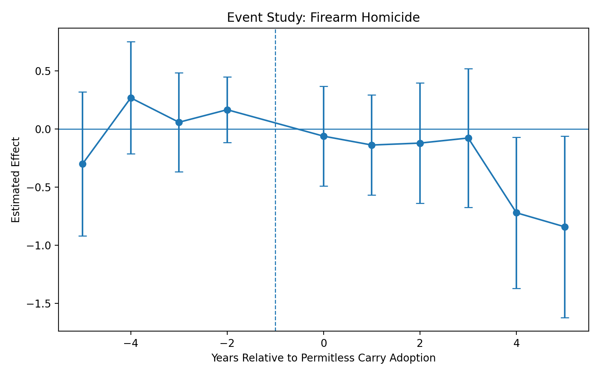
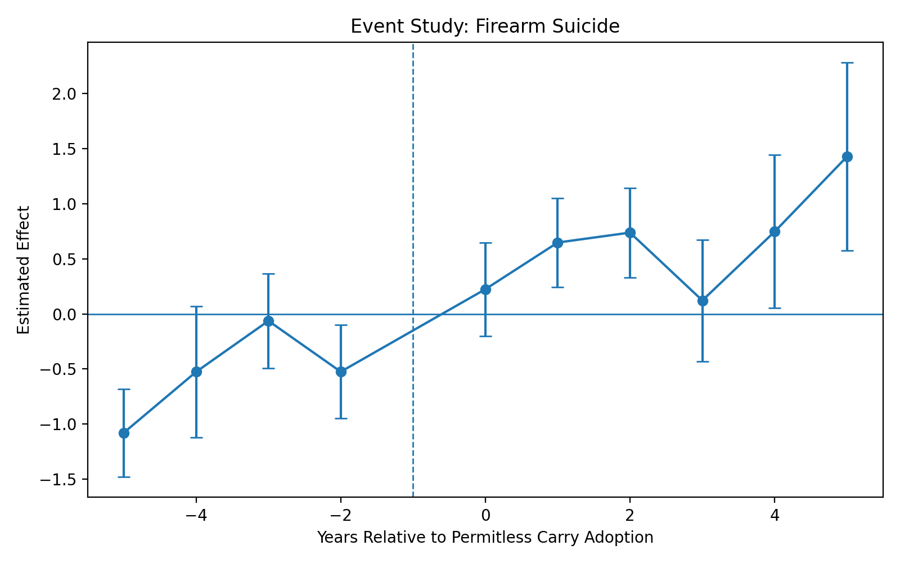
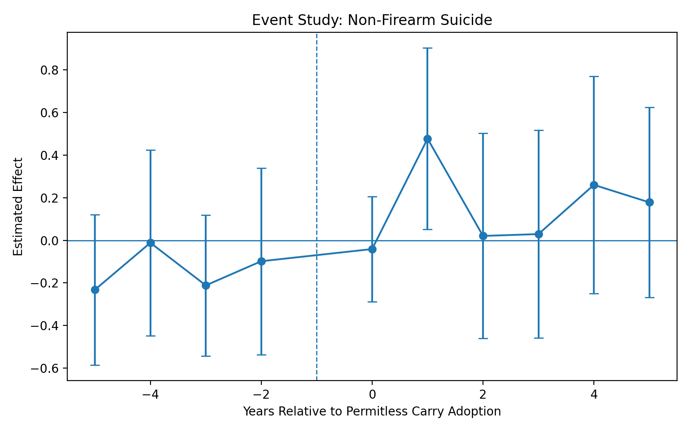
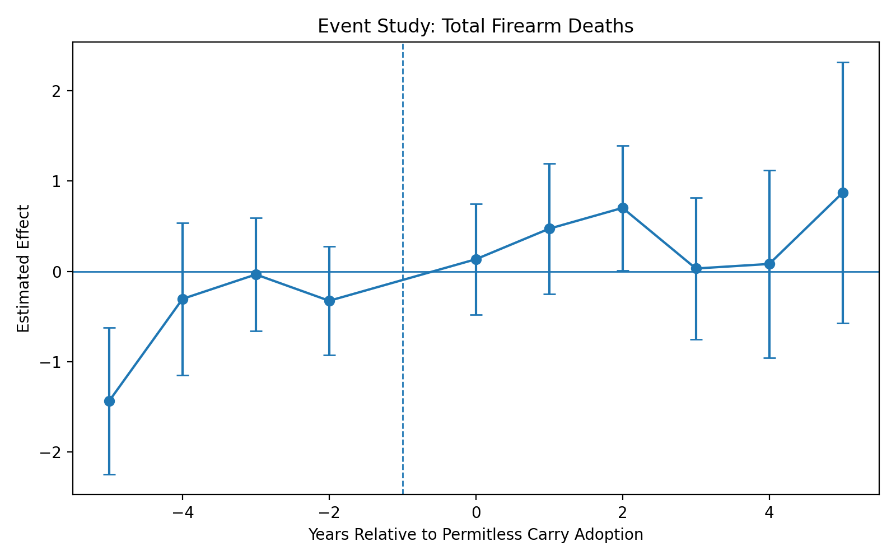
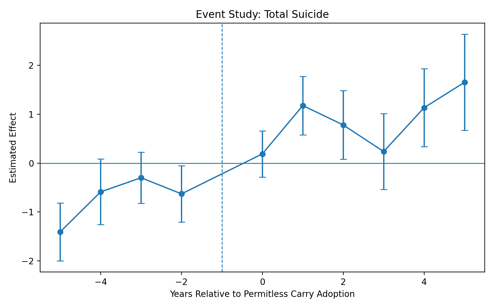
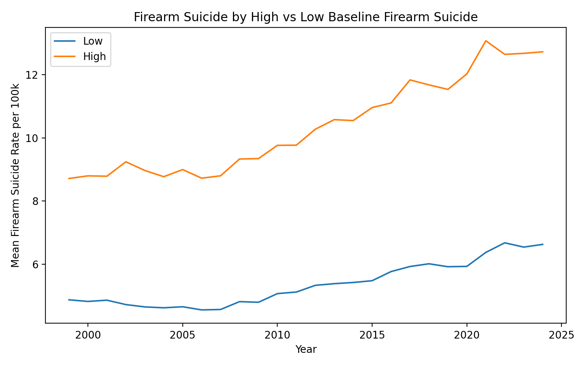
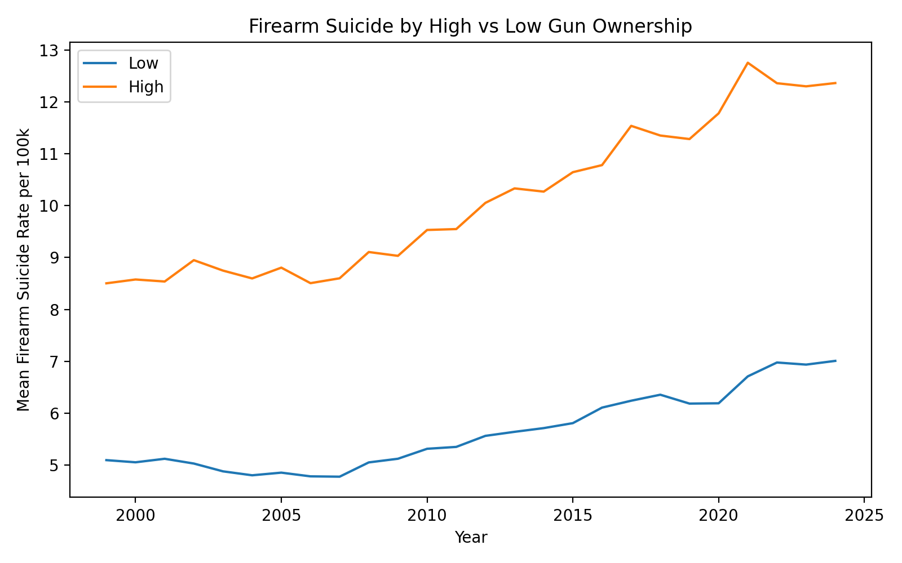
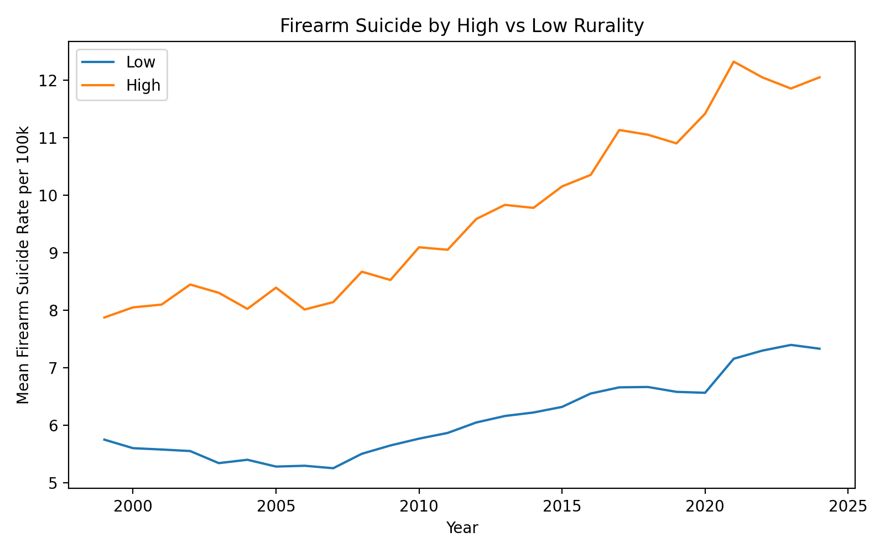
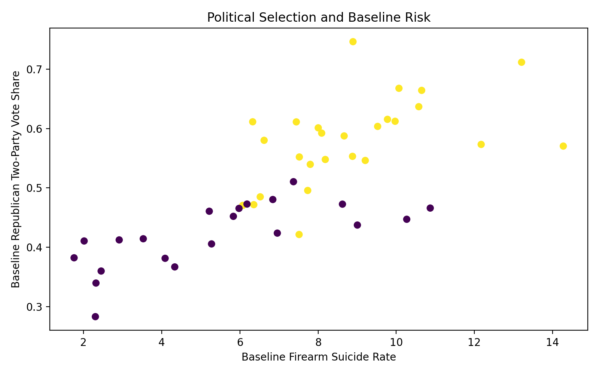

# Permitless Carry Policy Analysis (WRHC 2026)

This repository analyzes whether adoption of permitless carry firearm laws is associated with changes in firearm mortality rates across U.S. states.

The project constructs a state-year panel dataset for 1999-2024 and evaluates post-adoption mortality patterns using multiple empirical strategies:

- Change-score comparisons
- Two-way fixed effects difference-in-differences
- Event-study analysis
- Heterogeneity analysis
- Political-selection analysis

The goal is not to establish causal proof, but to provide transparent empirical comparisons using publicly available data.

## Research Question

After a state adopts permitless carry laws, do firearm mortality rates change differently than in states that do not adopt the policy?

The analysis examines:

- Firearm suicide
- Firearm homicide
- Total firearm deaths
- Total suicide
- Non-firearm suicide

## Data Sources

The project integrates multiple public datasets into a unified state-year panel.

### Mortality Data

CDC WONDER - Underlying Cause of Death

Outcomes are derived from ICD-10 mortality codes and converted to rates per 100,000 residents:

- Firearm suicide
- Firearm homicide
- Total firearm deaths
- Total suicide
- Non-firearm suicide

Coverage: 1999-2024.

### Covariates

- RAND State-Level Household Firearm Ownership Database: estimated household firearm ownership share and baseline firearm ownership.
- Bureau of Labor Statistics LAUS: state unemployment rate.
- Bureau of Economic Analysis: state per-capita personal income.
- USDA Economic Research Service: Rural-Urban Continuum Codes, mean rurality, and share of non-metro counties.
- MIT Election Lab U.S. Presidential Elections: Republican two-party vote share and baseline political environment.

Permitless carry adoption years were coded manually based on legislative enactment.

## Panel Dataset

Final dataset structure:

- State x year panel
- 1999-2024
- 50 U.S. states

Core variables:

- `firearm_suicide_rate_per_100k`
- `firearm_homicide_rate_per_100k`
- `total_firearm_rate_per_100k`
- `total_suicide_rate_per_100k`
- `nonfirearm_suicide_rate_per_100k`

Controls:

- `unemployment_rate`
- `income_pc`
- `gun_ownership`
- `rurality`

Policy variables:

- `permitless_year`
- `post_permitless`
- `years_since_permitless`

## Empirical Methods

### Change-Score Design

For each state:

`A = mean(post-adoption rate) - mean(pre-adoption rate)`

Change scores are compared between adopting states and non-adopting states using Welch two-sample t-tests.

Robustness windows:

- 2-year pre vs. 2-year post
- 3-year pre vs. 3-year post
- 5-year pre vs. 5-year post

### Difference-in-Differences

Panel regressions estimate:

```text
Outcome_st =
    beta * PostPermitless_st
    + state fixed effects
    + year fixed effects
    + unemployment
    + income
    + error
```

Standard errors are clustered at the state level.

### Event Study

Event-time models estimate dynamic effects relative to the year of policy adoption. These figures support inspection of pre-policy trends and post-policy outcome evolution.

### Heterogeneity Analysis

The analysis tests whether policy associations differ across:

- Baseline firearm ownership
- Rurality
- Baseline firearm suicide rates

### Political Selection

The project examines whether policy adoption is systematically associated with political ideology, firearm prevalence, and structural suicide risk.

## Results

### Change-Score Results

| Outcome | Window | p-value |
| --- | --- | --- |
| Total firearm deaths | 2y | 0.019 |
| Total firearm deaths | 3y | 0.192 |
| Total firearm deaths | 5y | 0.201 |
| Firearm homicide | 2y | 0.800 |
| Firearm homicide | 3y | 0.598 |
| Firearm homicide | 5y | 0.634 |
| Firearm suicide | 2y | 0.000036 |
| Firearm suicide | 3y | 0.035 |
| Firearm suicide | 5y | 0.000697 |

The strongest and most consistent statistical signal appears in firearm suicide. Firearm homicide shows no statistically significant change across any robustness window.

## Figures

### Publication Figures

The publication figure set is available in `outputs/figures/publication` as both PNG and PDF files.


### Event Studies











### Heterogeneity







### Political Selection



## Overall Interpretation

Across multiple empirical strategies, states adopting permitless carry laws tend to experience larger increases in firearm suicide rates relative to non-adopting states. No statistically significant association is detected between permitless carry adoption and firearm homicide rates.

Panel regressions also indicate increases in total suicide rates, suggesting that observed changes may reflect broader suicide trends rather than firearm-specific mechanisms alone. Associations appear stronger in states with higher baseline firearm suicide rates, higher firearm ownership, and greater rurality.

These findings should be interpreted cautiously due to the observational design and potential policy selection effects. Further research using individual-level data or alternative identification strategies would be necessary to establish causal mechanisms.

## Limitations

- The study uses quasi-experimental comparisons and cannot establish causal effects.
- States adopting permitless carry differ structurally and politically from non-adopting states.
- State-level analysis cannot identify individual-level behavioral mechanisms.
- Two-way fixed effects models may have limitations under staggered policy timing.

## Repository Structure

```text
src/
    data/
        build_master_analysis_panel.py
        extend_master_outcomes.py
        process_unemployment.py
        process_income.py
        process_gun_ownership.py
        process_rurality.py
        process_politics.py

    analysis/
        run_all_analysis.py
        interpret_results.py

data/
    raw/
    processed/

outputs/
    figures/
    tables/
```

## Reproducing the Analysis

Build the panel dataset:

```bash
python src/data/build_master_analysis_panel.py
python src/data/extend_master_outcomes.py
```

Run the full empirical analysis:

```bash
python src/analysis/run_all_analysis.py
```

Generate the interpretation report:

```bash
python src/analysis/interpret_results.py
```

Generate the publication figures:

```bash
python src/analysis/make_publication_figures.py
```

Outputs are written to `outputs/tables` and `outputs/figures`.

## Authors

Yucheng (Richard) Wang  
WRHC 2026 Research Project
